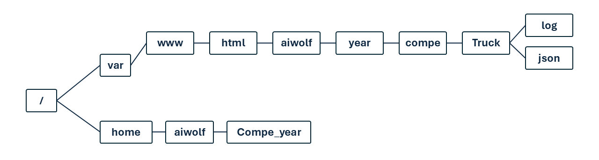

# 予選・本戦実行のコマンド一覧

実行コマンドおよびサーバの説明

[こちら](https://kanolab.net/redmine/projects/kanolab/wiki/%E4%BA%BA%E7%8B%BC%E7%9F%A5%E8%83%BD%E5%A4%A7%E4%BC%9A%E9%81%8B%E5%96%B6_%E5%A4%A7%E4%BC%9A%E5%B0%82%E7%94%A8%E3%82%B5%E3%83%BC%E3%83%90%E5%91%A8%E3%82%8A)を確認してください。
特に実行コマンドや具体的な編集内容は「実際の実行コマンド・サーバコード編集箇所と具体例・出力例の説明」の段落にまとめて記述してあります。

  
aiwolfサーバの主要なパスの構造

  

