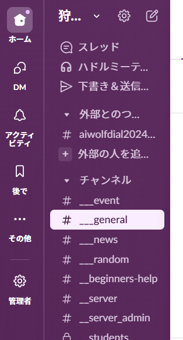

# Slack招待方法

- 歯車マークの「管理者」
    

    
参考画像

    
    

    
- 「メンバーを管理する」
    

    
参考画像

    
    

- 「名前またはメールアドレスで」
    

    
参考画像

    
    
    1. 参加登録GoogleFormに入力されたメールアドレスを入力
    
    2. 参加者が過去に出場したことがあった場合は検索結果にユーザが表示される
    

- 「･･･」→「アカウントを有効かする」
    

    
参考画像

    
    

- 「シングルチャンネルゲスト」→「次へ」
    

    
参考画像

    
    

- 「チャンネルを選択する」→「該当大会のチャンネル」→「シングルチャンネルゲストにする」
    

    
参考画像

    
    

- 「メンバーを招待する」
    

    
参考画像

    
    

- 「送信」
    

    
参考画像

    
    
    1. 送信先に参加登録GoogleFormに入力されたメールアドレスを入力
    
    2. 招待の種類は「ゲスト」
    
    3. チームのチャンネルに追加する「該当大会のチャンネル」
    
    4. 「送信」
    

===

GoogleFormに参加登録があるたびにこれらの作業を行う
